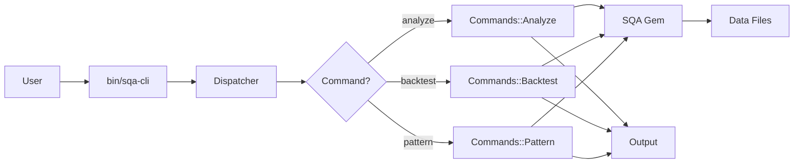

# Architecture

Overview of the SQA CLI application architecture and design decisions.

## Project Structure

```
sqa-cli/
├── bin/
│   └── sqa-cli              # Executable entry point
├── lib/
│   └── sqa/cli/
│       ├── commands/        # Command implementations
│       │   ├── base.rb      # Base command class
│       │   ├── analyze.rb
│       │   ├── backtest.rb
│       │   ├── genetic.rb
│       │   ├── pattern.rb
│       │   ├── kbs.rb
│       │   ├── stream.rb
│       │   └── optimize.rb
│       ├── dispatcher.rb    # Command router
│       └── version.rb       # Version info
├── test/                    # Minitest suite
├── data/
│   ├── stocks/              # Stock price CSV files
│   └── portfolios/          # Portfolio data
├── docs/                    # MkDocs documentation
├── Gemfile                  # Ruby dependencies
├── Rakefile                 # Rake tasks
└── mkdocs.yml              # Documentation config
```

## Design Patterns

### Command Pattern

SQA CLI uses the **Command Pattern** for modular, extensible command handling:

```ruby
# Dispatcher routes to appropriate command
class Dispatcher
  COMMANDS = %w[help version analyze backtest ...]

  def execute
    case command
    when 'analyze'
      Commands::Analyze.new(args).execute
    # ...
    end
  end
end
```

**Benefits:**
- Easy to add new commands
- Each command is independent
- Clear separation of concerns
- Similar to git, docker, kubectl

### Inheritance Hierarchy

```
Commands::Base
  ├── Commands::Analyze
  ├── Commands::Backtest
  ├── Commands::Genetic
  ├── Commands::Pattern
  ├── Commands::Kbs
  ├── Commands::Stream
  └── Commands::Optimize
```

All commands inherit from `Commands::Base` which provides:
- Option parsing with OptionParser
- Stock data loading
- Common output formatting
- Error handling
- Debug support

### Module Namespacing

```ruby
module SQA
  module CLI
    module Commands
      class Analyze < Base
        # ...
      end
    end
  end
end
```

**Benefits:**
- Avoids naming conflicts
- Clear organization
- Easy to understand relationships

## Core Components

### 1. Dispatcher (`lib/sqa/cli/dispatcher.rb`)

**Responsibilities:**
- Parse command-line arguments
- Route to appropriate command
- Handle unknown commands
- Display help

**Key Methods:**
- `run(args)` - Entry point
- `execute` - Route to command
- `show_help` - Display usage

### 2. Base Command (`lib/sqa/cli/commands/base.rb`)

**Responsibilities:**
- Option parsing
- Stock data loading
- Common formatting
- Shared functionality

**Key Methods:**
- `initialize(args)` - Setup
- `execute` - Abstract (must override)
- `load_stock` - Load stock data
- `parse_options` - Parse CLI options
- `print_header` - Format output
- `print_section` - Format output

### 3. Individual Commands

Each command implements:
- `execute` - Main execution logic
- `default_options` - Command defaults
- `add_command_options` - Command-specific options
- `banner` - Help text

### 4. Version Module (`lib/sqa/cli/version.rb`)

Simple module defining the version constant:

```ruby
module SQA
  module CLI
    VERSION = "0.1.0"
  end
end
```

## Data Flow



## Option Parsing

Uses Ruby's `OptionParser` for robust CLI parsing:

```ruby
def parse_options
  OptionParser.new do |opts|
    opts.banner = banner

    # Common options from base
    opts.on('-t', '--ticker SYMBOL', 'Stock ticker') do |ticker|
      @options[:ticker] = ticker.upcase
    end

    # Command-specific options
    add_command_options(opts)
  end.parse!(@args)
end
```

**Features:**
- Short and long options (-t, --ticker)
- Type conversion
- Default values
- Help generation
- Error handling

## Error Handling

Errors are caught and displayed to the user:

```ruby
def load_stock
  # ...
rescue => e
  puts "Error loading stock data: #{e.message}"
  exit 1
end
```

Exit codes:
- `0` - Success
- `1` - Error
- `2` - Unknown command

## Testing Strategy

Uses **Minitest** with the following approach:

### Test Organization

```
test/
├── test_helper.rb           # Test configuration
└── sqa/cli/
    ├── version_test.rb      # Version tests
    └── dispatcher_test.rb   # Dispatcher tests
```

### Test Coverage

Current coverage:
- Version info
- Dispatcher routing
- Help display
- Unknown commands
- Version command

**To Run:**
```bash
bundle exec rake test
```

## Dependencies

### Runtime Dependencies

- `sqa` - Core analysis library (local path)
- `debug_me` - Debugging utility (from GitHub)

### Development Dependencies

- `minitest` - Testing framework
- `minitest-reporters` - Colored test output
- `rake` - Build tool
- `rubocop` - Code linting
- `rubocop-minitest` - Minitest-specific linting

## Design Decisions

### 1. Why Command Pattern?

**Alternatives considered:**
- Single monolithic script
- Function-based approach

**Chosen because:**
- Scalability - Easy to add commands
- Maintainability - Each command isolated
- Testability - Test commands independently
- Industry standard - Similar to popular CLIs

### 2. Why Minitest vs RSpec?

**User preference:**
- Simpler syntax
- Faster execution
- Standard library (Ruby 1.9+)
- Less DSL magic

### 3. Why DebugMe gem?

**User requirement:**
- Better than `puts` debugging
- Structured debug output
- Easy to enable/disable
- Context preservation

### 4. Why Local SQA Gem?

**Development workflow:**
- Active development
- Easy to modify both projects
- No gem publishing needed
- Clear dependency relationship

## Extension Points

To add a new command:

1. **Create command file:**
   ```ruby
   # lib/sqa/cli/commands/new_command.rb
   class Commands::NewCommand < Base
     def execute
       # Implementation
     end
   end
   ```

2. **Add to dispatcher:**
   ```ruby
   # lib/sqa/cli/dispatcher.rb
   COMMANDS = %w[... new_command]
   ```

3. **Add tests:**
   ```ruby
   # test/sqa/cli/new_command_test.rb
   class NewCommandTest < Minitest::Test
     # Tests
   end
   ```

4. **Update documentation:**
   - Add to CLI Reference
   - Add usage examples
   - Update navigation

## Performance Considerations

### Current State

- Small codebase, minimal overhead
- Most time spent in SQA gem operations
- File I/O for stock data loading

### Future Optimizations

- **Caching:** Cache loaded stock data
- **Lazy Loading:** Only load needed data
- **Parallel Processing:** For portfolio optimization
- **Progress Indicators:** For long operations

## Security Considerations

### Input Validation

- Ticker symbols validated by SQA gem
- File paths checked before reading
- Options validated by OptionParser

### Data Safety

- Sample data only (no real trading)
- No external API calls in CLI
- No credential storage

## Future Architecture

Planned enhancements:

1. **Configuration File:**
   - YAML/TOML config
   - User preferences
   - Default options

2. **Plugin System:**
   - Custom commands
   - Strategy plugins
   - Indicator plugins

3. **Output Formats:**
   - JSON output
   - CSV export
   - HTML reports

4. **Interactive Mode:**
   - REPL for exploration
   - Persistent sessions
   - Command history

## See Also

- [CLI Reference](cli-reference.md) - Complete command reference
- [Testing](testing.md) - Testing guide
- [Contributing](contributing.md) - Development guide
